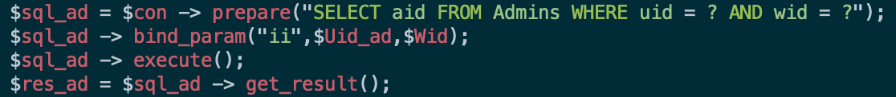
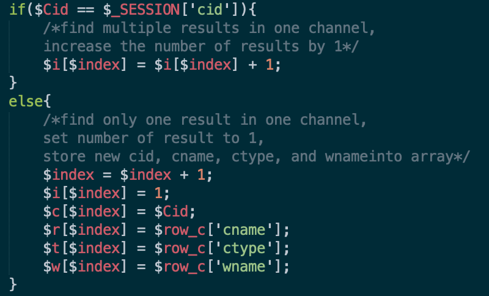

<h2>Web-based collaboration system --Snickr-- </h2>

Snickr is a collaboration system with MySQL supported underlying database system and PHP/HTML supported user friendly forum-like interface.

<h3>Features and interfaces</h3>

 (1)	Home page and account setups 
First, we start from the main page of our system.
In this page, information about workspaces are shown, including the name, description, creator and the time when it has been created.

  
On the top side of the table is a main menu, including several common operations in the system, like jump to home page, create a new workspace/channel, post a new message and a bookmark page. Besides, there is a search bar for us to enter and search any content in messages.
It should be noted that we can neither do any of these operation (except showing the home page) nor enter the workspaces, due to the lack of user authorization. So, we should create an account or sign in at first.

   
   
Here is the sign-up page, we should post all the information required from the form to the users table of our backend database.

  
Similarly, here is the sign in page, this time we only need a username and a matched password to pass the user authorization.

  
Once we logged in with an account, say Jon Snow, the main menu will show the username, a notification button, through which we can jump to the page showing all received invitations, and a sign out button.
  
Click the username at main menu, it will jump to a page showing the personal information and there is also a chance provided to change account information.
    
  
 (2)	Main functions on the menu bar 
In the “create a workspace” page, we need to enter the name and description to create a workspace, meanwhile, the user’s id and current time will be automatically logged on the workspace table as “wceratorid” and “wtime”.
   
Similarly, in the “create a channel” page, we can also create a channel by entering the subject, choosing a channel type and a workspace.
  
In the “post a message” page, we could choose a channel we have already joined, and enter anything we want as the content.
   
 (3)	System structure and management 
Now, let us show how the workspaces and channels are managed.
Enter an authorized workspace from the home page, we will find a list of all channels in the workspace. Otherwise, we could not see any detail about the workspace if the user is not authorized:

   
  
In the workspace page, there are four buttons have been set above the channel list. The first one is “add to bookmarks”, everyone can add the current page to his bookmark list. Besides, there are invite/kick members and add admins options for the creator only, the detail of these options is shown as below:
 

  
  
  
In the workspace page, we can also enter a channel if the user is authorized (that is, the channel is public, or the channel is private/direct and the user is a member of it).
 

   
In the channel page, we can see all the messages post in the channel, the sender of each message and the post time. There is also an “add to bookmarks” button on the above, which enable the user to add the current page to his bookmark list.
 

   
For private or direct channels, the creator will find two more options: “invite members” and “kick members”, the details are the same as options in the workspace page.
Every user has been invited to a workspace or a channel will receive a notification in the notification page, see as below:
 

   
   
   
 For each notification received, user can decide whether accept the invitation or not. 
After Accept, user can go to this workspace or channel:
  
After accept or decline, invite message will be removed:
  
 

 (4)	Other functions 
We can use the search bar to search any words in messages. The result will show as a list:
 

   
From here we can view every matched message and which channel/workspace it belongs. This result page can also be added into the bookmark page.
Note that a user can only access the results showing in the results page if this user is authorized to view this workspace/channel.
 

   
Here is the bookmark page. This page has a bookmark list. The name of each item has been labelled by “search results for”, “workspace” and “channel”. Following the link of bookmark we can reenter any page we have previous saved.
 

<h3>code fragments for some feature details</h3>

 (1)	Password encryption 
For safety considers, we use password_hash function to hash the password and store the hushed password into the database.
  
JonSnow’s actual password is “111111”: 

  
 (2)	User authentications 
There are multiple different types user authentications in our code:

Check if this user is signed in 

  
  
  
Check if this signed in user is authorized to do something 

Some pages use the urls, so need to make sure users can’t visit pages by manually setting the url field.  

  
  
  
For pages using the urls, we need to make sure users can’t visit pages without url field been set. 
For example, localhost/workspace.php?id=1 is a valid page,but localhost/workspace.php will return a warning message. 

  
  
After check, users can’t visit such pages:

  
  
 (3)	Uniqueness of username and nickname 
First, we use username for user’s logging in, and nickname as the identity of this user in Snickr. We don’t use email as sign up measurement, since some users might want to create multiple accounts using one email address. For example, a NYU professor may want to create an account identified as a professor of NYU, he might want to use NYU email as his personal contact information. He could create another account identified as a CEO of his own company registered under NYU, and he might also want to use NYU email as well.

Therefore, in order to use username to log in one particular user, and use nickname to identify one user in Snickr. We need to make them unique. And this is what we do:

Set UNIQUE attribute for username and unickname  

  
Check in code:  
 
  
  
 (4)	Prepared statements 
In order to guard against SQL injection attack, we use prepared statement method to execute the query:

  
  
 (5)	XSS prevention 
Use HTML Encoding htmlspecialchars() to convert any "HTML special characters" into their HTML encodings for all $_GET and $_POST variables retrieved from user’s input.

  
  
 (6)	Sanitize user’s input 
Some fields need further check to make sure there won’t be any unwanted data inserted into the database. And make sure users leave no necessary information blank.

  
  
  
  
  
 (7)	Transactions 
To ensure the Atomicity, Consistency, Isolation, Durability of the operations. We use transactions for more than one consecutive database manipulating queries. For example, two consecutive insertion, delete after insert, etc.

  
  
  
 (8)	Avoid data duplication 
Some of the operations will insert into our databases. It’s important to check if the data already exist in our database.   

  
  
 (9)	Number of results calculating for search page 
In order to return a nice page of results to views, calculate the number of matching results will be nice. We implement some arrays and store the number of results in the same page in those arrays:  

  
Here, we store the old Cid in the $_SESSION, and store the new cid inside $Cid 

  
Then compare new cid and old cid to check  

  
Print the numbers to views
 
  
 (10)	Dynamic, multiple/single selection bar implementation 
Let users can choose multiple/single values at a time. And the options are dynamic (depends on the actual database data).    
  
  
 (11)	Logistic of add admins 
An admin can add other non-admin users to this workspace.

 
  
(12)	Logistic of member kick 
<ul>
<li>For channel’s members, it’s sufficient to only delete member form Cmembers table.</li>
<li>However, for workspace’s members, kick operation needs to delete member form Wmembers table, also need to delete member from underlying Cmembers’s table if this user is a member of some channels and Admins table if this member is admin of this workspace.
</li></ul>
(13)	Logistic of member invite 
<ul>
<li>If an admin invites a user to a workspace, it will add a new row to the Winvite table. If the invited user accept the invitation, this row will be removed from Winvite table. And a new row will be added to the Wmembers table.</li> 
<li>If an admin invites a user to a channel, the type of channel will be checked first. The invite button won’t show for a public channel, since it’s open to all. For a direct channel, if there is a row in Cinvite table, the admin cannot invite more users since max member is 2 for a direct channel. Invite to private channel works like workspace invitation.</li>
<li>An admin can’t invite the same non-member user if there is a row in the Winvite/Cinvite table. Therefore, the same user can only be invited by the same admin again after that user decline the invitation.</li>
